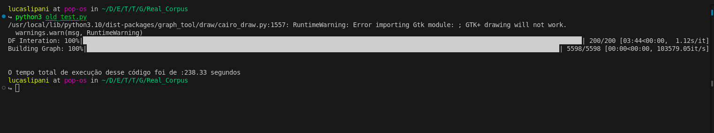
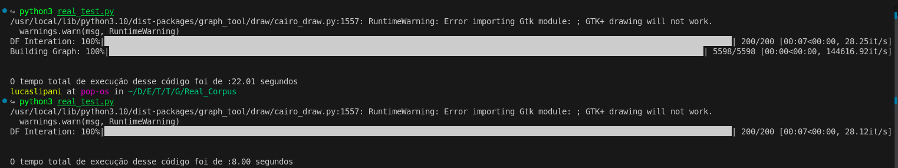

# Resume: Tremplin Recherche - GraphTools Test

## Project Overview
This project extends Gerlach's study on the application of the Stochastic Block Model (SBM) in organizing and classifying written text. The study highlights the growing importance of statistical methods in handling large volumes of digital content. [Read the study](https://www.science.org/doi/10.1126/sciadv.aaq1360).

## Key Concepts

### 1. Statistical Classification
Two primary approaches exist in statistical classification:
- **Discriminative Models**: Identify patterns or boundaries that separate data classes based on specific features.
- **Generative Models**: Analyze how data is generated to define class boundaries.

### 2. Stochastic Block Model (SBM)
SBM is a generative model for random graphs, commonly used for community detection. It identifies hidden structures in complex networks by clustering nodes into communities based on connectivity patterns.

### 3. Bayesian Approach
The Bayesian method updates prior knowledge using observed data through Bayes' theorem:
$$
P(\text{hypothesis | data}) = \frac{P(\text{data | hypothesis}) \cdot P(\text{hypothesis})}{P(\text{data})}
$$

### Components:

- **Prior (*P(hypothesis)*)**:  
  Represents the knowledge or beliefs about the hypothesis before observing the data.

- **Evidence (*P(data)*)**:  
  The probability of the observed data across all possible hypotheses.

- **Likelihood (*P(data | hypothesis)*)**:  
  Measures how likely it is to observe the data given a specific hypothesis.

- **Posterior Distribution (*P(hypothesis | data)*)**:  
  Updates the prior in light of new data, resulting in the "new belief" about the hypothesis.

### 4. Bayesian Model Comparison
Bayesian reasoning simplifies model comparison by focusing on relative evidence. The Bayes Factor quantifies how well one model explains the data relative to another:

$$
\frac{P(M_1 \mid D)}{P(M_2 \mid D)} = \frac{P(D \mid M_1) \cdot P(M_1)}{P(D \mid M_2) \cdot P(M_2)}
$$

### 5. Bayesian SBM
Bayesian SBM improves traditional SBM by integrating prior knowledge about intra-community connections. It optimally determines the number of communities, balancing model complexity and data fit.

<!-- ### 6. Markov Chain Monte Carlo (MCMC)
MCMC methods, such as Metropolis-Hastings and Gibbs Sampling, efficiently approximate posterior distributions when direct computation is impractical. These methods help estimate parameters in Bayesian SBM. -->

### 6. Domain Chained Model
A probabilistic framework that structures relationships within domains hierarchically, reflecting dependencies between dimensions.

# Case Study
To apply the theoretical concepts discussed above and to ensure a deeper understanding of the project, a simple SBM implementation was developed using a corpus of articles.

## Project Evolution
Initially, the project constructed a graph based on term-to-term relationships, forming communities using an NLP-based approach applied directly to terms.

Later, the code was modified to align more closely with the approach used in Sashimi. In this revised version, the graph represents Document-Term relationships rather than direct term connections.

Several optimizations were introduced to improve performance, such as:
- Implementing a dictionary-based lookup system to check if a term already exists in the graph, reducing redundancy.
- Using the **TQDM** library to monitor execution time in iterative loops, ensuring better performance tracking.

## Results 

So far, we have obtained some interesting results, as shown in the following sequence.

The first image illustrates the time required to run the code without using a dictionary. In contrast, the second image demonstrates the performance improvement achieved by using a dictionary and disabling graph visualization.

## Future Directions
- [x] Theoretical clarifications and guidance on the project's methodology.
- [x] Practical test using a corpus to establish Document-Term relationships.
- [ ] Practical test using a corpus to establish Document-Word Set relationships.
- [ ] Practical test using a corpus to establish Document-Semantic Meaning relationships.
- [ ] Presentation of the project for module E4.
- [ ] Interactive Interface: Web-based interface with hover-triggered information display.
- [ ] **Performance Improvements:**
  - [ ] Optimization of topic fixation. (Probability)
- [ ] **Interface Improvements:**
  - [ ] Interface allowing users to modify elements within a block.
  - [ ] Generating logs of these modifications.
- [ ] Analysis of Luiz Daniel’s code for corpus learning reuse.
- [ ] Term Labeling: Use ontology-based term classification instead of raw term blocks.

---
This README provides an overview of the theoretical foundations and methodology applied in this project. For further discussions and improvements, contributions are welcome.

